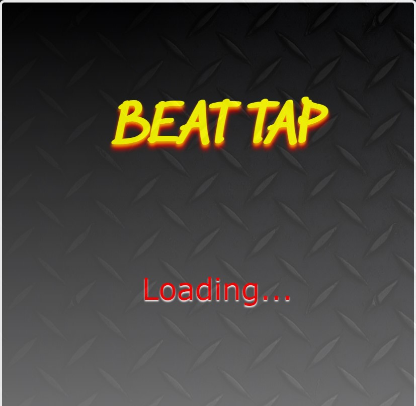
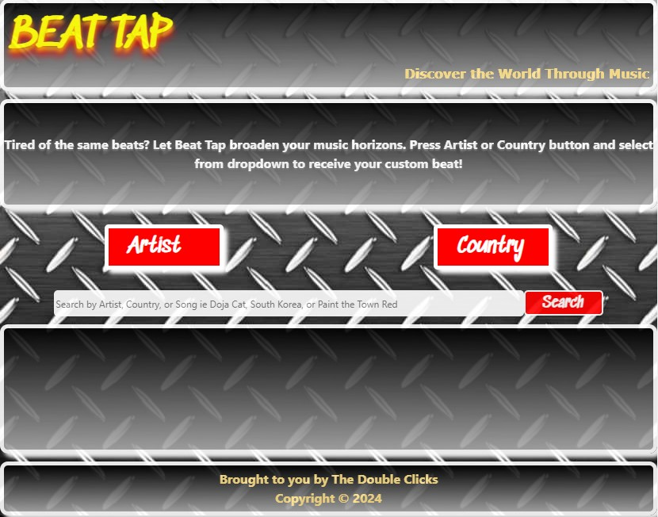
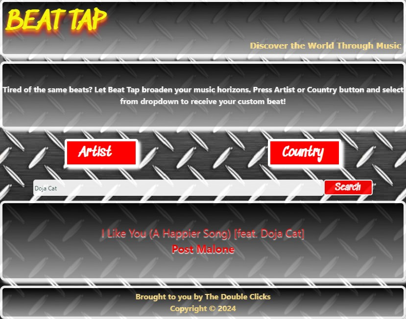

# Beat Tap

## Description

This is code for an application named Beat Tap. This is an application that allows the user to discover the world through music.

## Installation

N/A

## Usage

The user can search for songs by Artist by clicking on the Artist Button or search for songs in a particular country by using the Country Button. The user can also search for songs by Artist, Country or Song in the main Search Box. All songs will be displayed on the main page.

## Credits

Coding done in collaboration with Itzel Hernandez, Gabe Harvey, Jacobo Gonzalez, and Steven Berry

Music Brainz API: https://musicbrainz.org/doc/MusicBrainz_API

Rest Countries API: https://restcountries.com/

iTunes Search API: https://developer.apple.com/library/archive/documentation/AudioVideo/Conceptual/iTuneSearchAPI/index.html

## Screenshots

## Link to Website

https://gabeharvey.github.io/beat-tap/

## License

Please refer to LICENSE in Beat Tap Repository.